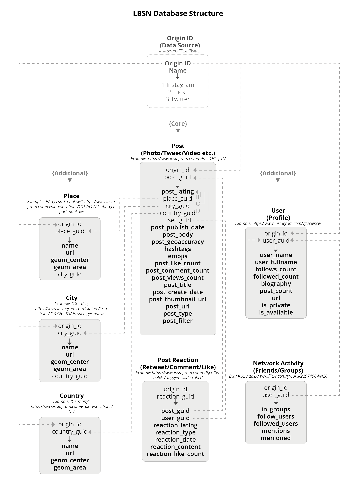

  

# Welcome to the LBSN Structure Concept Docs

This documentation contains information on the current **lbsn structure concept** version.

The structure is tightly coupled with a Postgres SQL datascheme that is maintained [separately](https://gitlab.vgiscience.de/lbsn/database-setup). The database is ready to use with the provided Docker container that optionally includes a PGadmin interface.

A python compiled version of the structure is available on [Pypi](https://pypi.org/project/lbsnstructure/), but the structure can be exported to any language supported by Google's [Protocol Buffers](https://developers.google.com/protocol-buffers/).

There exist several tools that help migrating data and maintaining the structure. The python package [lbsntransform](https://pypi.org/project/lbsntransform/) allows bulk conversion and database update of large volumes of proprietary data (e.g. CSV, JSON) that was retrieved from various API endpoints (e.g. Twitter, Flickr).

A [fullstack docker project generator](https://gitlab.vgiscience.de/lbsn/theplink-docker) is available that includes Postgres, pgadmin, a web api, a frontend and other features (such as Alembic database migrations).

This documentary illustrates the various use cases, definitions and applications. Contributions [welcome](https://gitlab.vgiscience.de/lbsn/concept).

# Introduction

At the core of the structure is the table "post". Additional tables are available for hierarchical location information ("place", "city", "country") and user background information ("user"). Data from different services is assigned to matching attributes and stored in the same structure (e.g. posts from Instagram and Flickr can both be found in table "post"). To distinguish between sources, an origin_id is attached and used in a composite-key with the service's own Global Unique IDs (GUID). Origin_IDs are referenced from the table "origin", e.g.:

* 1 - Instagram
* 2 - Flickr
* 3 - Twitter

Most elements of posts are available for all 3 services. If data is not available, columns are left blank. For example, "post_create_date" as the time a photo was taken is not available on Instagram, only "post_publish_date" - therefore, "post_create_date" will always be NULL for Instagram (on Flickr, both sets of information are available). If Instagram should, at some point, provide information on "post_create_date", it can be used to update database without modifying its structure.

**Simplicity-Convention:**
The relational structure used here is intended as the lowest common denominator between different service's graph structures. Graph Structures are powerful for their extensibility, but they're weak for making sense due to their complexity. In this relational database we're aiming for a reduced complexity and a common, structured mapping between different graphs. Inevitably, and by intent, this structure will sacrifice some detail of information in favor of a common generalization scheme for quantitaive analysis.

**NULL Convention:**
In the database, **NULL** is used for entries that are **a)** either not available at all (e.g. post_create_date for Instagram) or **b)** have not yet been retrieved. If a field has been retrieved but was found empty (e.g. if an Instagram user did not provide any "bio" information), the database entry will instead be set to an empty string (""). This difference helps distinguish between unavailable/not yet retrieved information and information left blank explicitly/on purpose.

**Geo Convention:**
Posts are only stored with location information available (either specific coordinates or substituted information from place table). While it is possible to store non-geotagged posts, this would unnecessarily blow up the database.

**User Privacy Conventions:**
[This page](security-anonymization) contains some guidelines regarding anonymization and user privacy. In summary, 1) individual user's data must not be exposed and 2) RAW data must not be publicly shared.

**Time Convention:**
Different services handle timestamps and timezones differently. Three aspects of time are relevant:
- (1) the local time of the user (when the post was created or published)
- (2) the absolute UTC/GMT time (the number of seconds passed since Jan 1, 1970 in UTC, which is the same as GMT)
- (3) the local time of viewer (e.g. when viewing a tweet online, this prevents the paradox of seeing something that appears published in the future)  

Example: *(1)* A Tweet was published at 9:37 in Berlin (+2 CEST), *(2)* Twitter stores this as 7:37 UTC (+00), and *(3)* when this tweet is viewed in California (-7 PT), the time that the user sees is 12:37 AM (translated to local time of the viewer).
Usually, in analysis, we're interested in the local time of the contributing user, not the viewer. For Flickr and Instagram, for example, this time is directly available from the API. 
For Twitter, the local time must be calculated, based on additional criteria that are [sometimes available](https://zacharyst.com/2017/04/05/assigning-the-correct-time-to-a-tweet/).
In postgres, there are two options: saving times as `timestamp without timezone` or `timestamp with timezone`. However, Postgres will [never store timezone information in the timestamp](http://phili.pe/posts/timestamps-and-time-zones-in-postgresql/), the 'timezone' here refers only to how the timestamp is formatted when *displaying* Postgres timestamps (3).
Therefore, when storing posts, **timestamps should not be processed**. They're dealt with as a `timestamp without timezone` because we do not know the timezone of the contributing user without taking into account additional information. For some services, such as Twitter, it is the task of the analyst to translate this time to the local time of the user before analysis (e.g. by taking into account utc_offset, location of post, language or other attributes).

## Structure Structure

[Overview](structure-overview)



## Example Queries

[Example SQL Queries for LBSN-DB](example-queries)

## Changelog

**0.9.1 - 2018-01-03**

* added table post_reaction
   * used to store comments, retweets, likes etc.
* added trigger functions
   * post_latlng, if not available, is substituted by geom_center from table place; geoaccuracy is set to "place"
   * city_guid and country_guid are added automatically to all matching posts if place or city table is updated
   * city_guid and country_guid are added automatically if submitted post contains place information but no city_guid or country_guid

**0.9.0 - 2017-12-05**

* first stable version
* new tables test:
   * post_reaction (comments, emojies, reposts,replies, shares etc.)
   * network (list of social contacts, @mentions, face-tags, belonging to specific interest groups etc.)

## SQL Create Table

This is a static copy of what can be found in [101-create-tables.sql](https://gitlab.vgiscience.de/lbsn/database-setup/blob/master/101-create-tables.sql) and may therefore not reflect its current, up-to-date content.

```sql
/*******************************************************************************
 * Configuration for LBSN Database with PostgreSQL and PostGIS
 *******************************************************************************
 */


/** Delete everything
 */
DROP SCHEMA IF EXISTS public CASCADE;
CREATE SCHEMA public;

GRANT ALL ON SCHEMA public TO postgres;
GRANT ALL ON SCHEMA public TO public;


/**Grant priviliges to our user group
 */
GRANT ALL PRIVILEGES ON SCHEMA public TO ifk_user;
GRANT ALL PRIVILEGES ON SCHEMA public TO rahul;


/** Create PostGIS extension
 */
CREATE EXTENSION postgis;


/** Create table origin
 */
CREATE TABLE public."origin" (
    origin_id serial PRIMARY KEY,
    name text UNIQUE
);


/** Create table user
 */
CREATE TABLE public."user" (
    origin_id int REFERENCES public."origin"(origin_id),
    user_guid text,
    PRIMARY KEY (origin_id, user_guid),
    user_name text,
    user_fullname text,
    follows bigint,
    followed bigint,
    biography text,
    post_count bigint,
    url text,
    is_private boolean,
    is_available boolean
);

/** Geo information hierarchy
 * Hierarchy of Geo-Info: Country Scale -> City Scale -> Place Scale -> Post latlng,
 * Specify highest available geoaccuracy in post_geoaccuracy, either "latlng", "place", "city" or "country"
 * Reference different services should through origin_id
 * At the time being, "country", "city" and "place" references are not disambiguated between services, for example, there may be a Country ID "1_652136" -> "Germany" (Instagram) and ID 2_675217653 -> "Germany" (Twitter)
 */
CREATE TABLE public."country" (
    country_guid text,
    origin_id int REFERENCES public."origin"(origin_id),
    PRIMARY KEY (origin_id, country_guid),
    name text,
    geom_center geometry(Point, 4326),
    geom_area geometry(Polygon, 4326)
);

CREATE TABLE public."city" (
    city_guid text,
    origin_id int REFERENCES public."origin"(origin_id),
    PRIMARY KEY (origin_id, city_guid),
    name text,
    geom_center geometry(Point, 4326),
    geom_area geometry(Polygon, 4326),
    country_guid text,
    FOREIGN KEY (origin_id, country_guid) REFERENCES public."country"(origin_id, country_guid)
);

/** Create table place
 */
CREATE TABLE public."place" (
    origin_id int REFERENCES public."origin"(origin_id),
    place_guid text,
    PRIMARY KEY (origin_id, place_guid),
    name text,
    url text,
    geom_center geometry(Point, 4326),
    geom_area geometry(Polygon, 4326),
    city_guid text,
    FOREIGN KEY (origin_id, city_guid) REFERENCES public."city"(origin_id, city_guid)
);

/** Create table post
 *
 * post_type: video (instagram), image (instagram, flickr), text (twitter)
 * post_body: description (flickr), caption (instagram), tweet (twitter)
 * hashtags: array of strings
 * smilies: array of strings
 */
CREATE TABLE public."post" (
    origin_id int REFERENCES public."origin"(origin_id),
    post_guid text,
    PRIMARY KEY (origin_id, post_guid),
    post_latlng geometry(Point, 4326), --only if lat/lng coordinates are available, otherwise add location information as in place, city or country table
    place_guid text,
    FOREIGN KEY (origin_id, place_guid) REFERENCES public."place"(origin_id, place_guid),
    city_guid text,
    FOREIGN KEY (origin_id, city_guid) REFERENCES public."city"(origin_id, city_guid),
    country_guid text,
    FOREIGN KEY (origin_id, country_guid) REFERENCES public."country"(origin_id, country_guid),
    user_guid text,
    FOREIGN KEY (origin_id, user_guid) REFERENCES public."user"(origin_id, user_guid),
    post_publish_date timestamp,
    post_body text,
    post_geoaccuracy text, --specify highest location accuracy available, either "latlng", "place", "city" or "country"
    hashtags text[] NOT NULL DEFAULT '{}', -- Hashtags now stored in array, see http://www.databasesoup.com/2015/01/tag-all-things.html
    smilies text[] NOT NULL DEFAULT '{}',
    post_like_count bigint,
    post_comment_count bigint,
    post_views_count bigint,
    post_title text,
    post_create_date timestamp,
    post_thumbnail_url text,
    post_url text,
    post_type text,
    post_filter text
);

COMMENT ON COLUMN public."post".post_geoaccuracy IS 'Specifies highest location accuracy available, either "latlng", "place", "city" or "country"';
 
/** Fill Table origin
 */
INSERT INTO public."origin" (name) VALUES
    ('Flickr'),
    ('Instagram'),
    ('Twitter');

/** Insert Null Island place
 */
INSERT INTO public.place (place_guid, origin_id, name, url, geom_center) VALUES
    ('0', '1', 'Null Island', 'https://en.wikipedia.org/wiki/Null_Island', ST_GeomFromText('POINT(0 0)', 4326)), -- Twitter
    ('0', '2', 'Null Island', 'https://en.wikipedia.org/wiki/Null_Island', ST_GeomFromText('POINT(0 0)', 4326)), -- Instgram
    ('0', '3', 'Null Island', 'https://en.wikipedia.org/wiki/Null_Island', ST_GeomFromText('POINT(0 0)', 4326)); -- Flickr


/** Create Indexes
*/
CREATE INDEX country_geom ON public.country USING gist (geom_center);
CREATE INDEX city_geom ON public.city USING gist (geom_center);
CREATE INDEX place_geom ON public.place USING gist (geom_center);
CREATE UNIQUE INDEX idx_post ON public.post(origin_id, post_guid);
CREATE INDEX idx_post_latlng ON public.post USING gist (post_latlng);
CREATE INDEX idx_post_create_date ON public.post USING brin (post_create_date);
CREATE INDEX idx_post_publish_date ON public.post USING brin (post_publish_date);
CREATE INDEX idx_post_hashtags ON public.post USING gin (hashtags);
CREATE INDEX idx_post_origin_id ON public.post USING brin (origin_id);
CREATE INDEX idx_post_place_guid ON public.post USING brin (place_guid);
CREATE INDEX latlng_geom ON public.post USING gist (post_latlng);
--CREATE UNIQUE INDEX idx_place ON public.place(origin_id,place_guid);
--CREATE UNIQUE INDEX idx_post_place ON public.post(origin_id,place_guid);

```